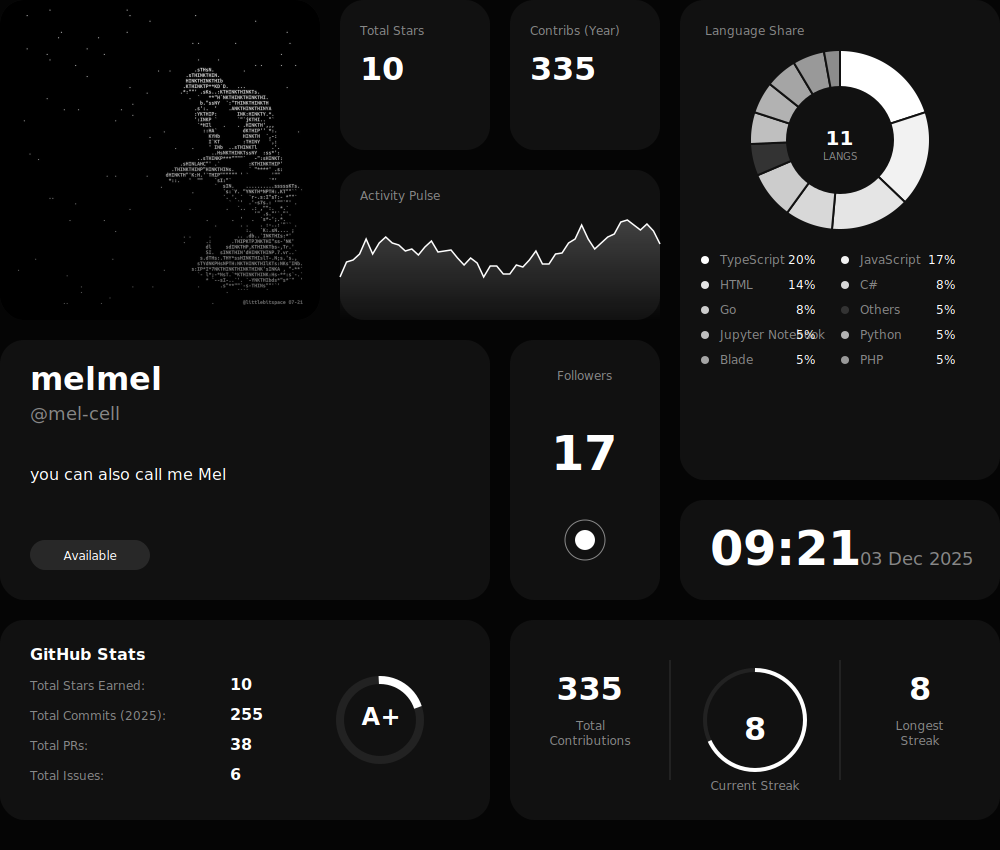

# Hi there, I'm mel-cell 👋

  <!-- START_GRID -->
  
  <!-- END_GRID -->

   
  

    <strong>Web Developer | DevOps | Machine Learning Engineer</strong>
  

  

    <em>Building innovative solutions and thriving in dynamic environments.</em>
  

---

  <h3>Connect with me</h3>
  
  <!-- Add more socials here if needed -->

